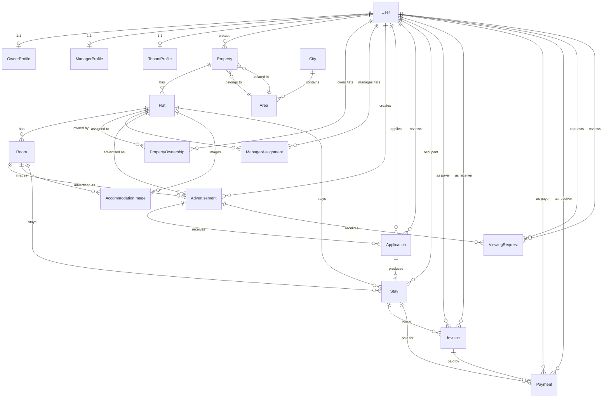

# Database Design

This document describes the PostgreSQL database for the Housing & Roommate platform. The schema is defined with Prisma in `prisma/schema/*.prisma` and the client is generated to `generated/prisma/`.

## Overview

- **Database:** PostgreSQL
- **ORM:** Prisma 7 (`prisma-client` generator)
- **Default key:** all tables use `id String @id @default(uuid())`
- **Timestamps:** most tables have `createdAt DateTime @default(now())` and `updatedAt DateTime @updatedAt`
- **Money:** monetary fields use `Decimal(12, 2)`
- **Coordinates:** `Decimal(10, 7)`
- **Design rule:** ownership and manager assignment exist **only at the Flat level** — a Property has no owner, a person owns one or more Flats.

## Entity List

| # | Table | Purpose |
| --- | --- | --- |
| 1 | `User` | Users of all roles (OWNER / MANAGER / TENANT / ADMIN) |
| 2 | `OwnerProfile` | Extra profile data for owners |
| 3 | `ManagerProfile` | Extra profile data for managers |
| 4 | `TenantProfile` | Extra profile data for tenants |
| 5 | `City` | Cities (location hierarchy top level) |
| 6 | `Area` | Areas within a city |
| 7 | `Property` | A building/compound containing flats |
| 8 | `Flat` | A flat unit in a property |
| 9 | `Room` | A room within a flat |
| 10 | `PropertyOwnership` | Who owns a flat (flat-level ownership) |
| 11 | `ManagerAssignment` | Which manager is assigned to a flat |
| 12 | `AccommodationImage` | Images for a flat or a room |
| 13 | `Advertisement` | Rental / roommate listings (flat or room) |
| 14 | `Application` | Tenant applications against an advertisement |
| 15 | `Stay` | A booking/stay created from an approved application |
| 16 | `Invoice` | Rent (RENT) and utility (UTILITY) bills |
| 17 | `Payment` | Payments with gateway metadata |
| 18 | `ViewingRequest` | Requests to view an advertised flat/room |

## ERD

### Relationship Card

| From | To | Cardinality | Notes |
| --- | --- | --- | --- |
| `User` | `OwnerProfile` / `ManagerProfile` / `TenantProfile` | 1 → 0..1 | One profile per user depending on role (`userId` unique) |
| `User` | `Property` | 1 → 0..N | `createdById` |
| `User` | `PropertyOwnership` | 1 → 0..N | as **owner** (`FlatManager` relation) |
| `User` | `ManagerAssignment` | 1 → 0..N | as **manager** (`FlatOwner` relation) |
| `User` | `Advertisement` | 1 → 0..N | `createdById` |
| `User` | `Application` | 1 → 0..N | as **applicant** and as **reviewer** (`reviewedById` nullable) |
| `User` | `Stay` | 1 → 0..N | `occupantId` |
| `User` | `Invoice` | 1 → 0..N | as **payer** and as **receiver** (two FKs) |
| `User` | `Payment` | 1 → 0..N | as **payer** and as **receiver** (two FKs) |
| `User` | `ViewingRequest` | 1 → 0..N | as **requester** and as **reviewer** (`reviewedById` nullable) |
| `City` | `Area` | 1 → 0..N | `cityId`; unique on `(cityId, name)` |
| `Area` | `Property` | 1 → 0..N | `areaId` (mandatory) |
| `Property` | `Flat` | 1 → 0..N | unique on `(propertyId, flatNumber)` |
| `Flat` | `Room` | 1 → 0..N | unique on `(flatId, roomNumber)` |
| `Flat` | `PropertyOwnership` / `ManagerAssignment` | 1 → 0..N | flat-level ownership & management |
| `Flat` / `Room` | `AccommodationImage` | 1 → 0..N | exactly one of `flatId`/`roomId` set; cascade delete |
| `Flat` / `Room` | `Advertisement` | 1 → 0..N | exactly one of `flatId`/`roomId` may be set |
| `Advertisement` | `Application` / `ViewingRequest` | 1 → 0..N | `advertisementId` |
| `Application` | `Stay` | 1 → 0..1 | `applicationId` is unique on `Stay` |
| `Stay` | `Invoice` / `Payment` | 1 → 0..N | `stayId` |
| `Invoice` | `Payment` | 1 → 0..N | `invoiceId` nullable on `Payment` |

## Tables

### 1. User

| Field | Type | Notes |
| --- | --- | --- |
| `id` | String (uuid) | PK |
| `name` | String | |
| `email` | String | **unique** |
| `phone` | String | Not unique anymore |
| `password` | String? | Nullable (Google-only accounts) |
| `role` | `Role` | default `TENANT` |
| `status` | `UserStatus` | default `PENDING_APPROVAL` |
| `emailVerified` | Boolean | default `false` |
| `googleId` | String? | **unique** |
| `authProvider` | `AuthProvider`? | default `CREDENTIAL` |
| `createdAt` / `updatedAt` | DateTime | |

### 2–4. OwnerProfile / ManagerProfile / TenantProfile

Identical shape:

| Field | Type | Notes |
| --- | --- | --- |
| `id` | String (uuid) | PK |
| `userId` | String | **unique**, FK → `User` |
| `nid` | String? | **unique** |
| `address` | String? | |
| `occupation` | String? | |
| `createdAt` / `updatedAt` | DateTime | |

### 5. City

| Field | Type | Notes |
| --- | --- | --- |
| `id` | String (uuid) | PK |
| `name` | String | **unique** |
| `createdAt` / `updatedAt` | DateTime | |

### 6. Area

| Field | Type | Notes |
| --- | --- | --- |
| `id` | String (uuid) | PK |
| `cityId` | String | FK → `City` |
| `name` | String | unique with `(cityId, name)` |
| `createdAt` / `updatedAt` | DateTime | |

### 7. Property

| Field | Type | Notes |
| --- | --- | --- |
| `id` | String (uuid) | PK |
| `name` | String | |
| `type` | `PropertyType` | `SINGLE_FLAT` / `MULTI_FLAT` |
| `description` | String? | |
| `address` | String | |
| `postalCode` | String? | |
| `areaId` | String | FK → `Area` (mandatory) |
| `latitude` | Decimal(10, 7)? | |
| `longitude` | Decimal(10, 7)? | |
| `status` | `PropertyStatus` | default `ACTIVE` |
| `createdById` | String | FK → `User` |
| `createdAt` / `updatedAt` | DateTime | |

### 8. Flat

| Field | Type | Notes |
| --- | --- | --- |
| `id` | String (uuid) | PK |
| `propertyId` | String | FK → `Property` |
| `flatNumber` | String | unique with `(propertyId, flatNumber)` |
| `floorNumber` | Int? | |
| `bedrooms` | Int? | |
| `bathrooms` | Int? | |
| `areaSqFt` | Decimal(10, 2)? | |
| `description` | String? | |
| `status` | `FlatStatus` | default `ACTIVE` |
| `createdAt` / `updatedAt` | DateTime | |

### 9. Room

| Field | Type | Notes |
| --- | --- | --- |
| `id` | String (uuid) | PK |
| `flatId` | String | FK → `Flat` |
| `roomNumber` | String | unique with `(flatId, roomNumber)` |
| `name` | String? | |
| `areaSqFt` | Decimal(10, 2)? | |
| `description` | String? | |
| `status` | `RoomStatus` | default `ACTIVE` |
| `createdAt` / `updatedAt` | DateTime | |

### 10. PropertyOwnership

Flat-level ownership (a Property has no owner).

| Field | Type | Notes |
| --- | --- | --- |
| `id` | String (uuid) | PK |
| `flatId` | String | FK → `Flat` |
| `ownerId` | String | FK → `User` |
| `status` | `OwnershipStatus` | default `ACTIVE` |
| `startedAt` | DateTime | default `now()` |
| `endedAt` | DateTime? | |
| `createdAt` / `updatedAt` | DateTime | |

### 11. ManagerAssignment

Manager assignments are **always at the Flat level**.

| Field | Type | Notes |
| --- | --- | --- |
| `id` | String (uuid) | PK |
| `flatId` | String | FK → `Flat` |
| `managerId` | String | FK → `User` |
| `status` | `ManagerAssignmentStatus` | default `ACTIVE` |
| `startedAt` | DateTime | default `now()` |
| `endedAt` | DateTime? | |
| `createdAt` / `updatedAt` | DateTime | |

### 12. AccommodationImage

| Field | Type | Notes |
| --- | --- | --- |
| `id` | String (uuid) | PK |
| `imageUrl` | String | |
| `publicId` | String? | Cloudinary public ID |
| `flatId` | String? | FK → `Flat`, cascade delete |
| `roomId` | String? | FK → `Room`, cascade delete |
| `sortOrder` | Int | default `0` |
| `isPrimary` | Boolean | default `false` |
| `createdAt` / `updatedAt` | DateTime | |

### 13. Advertisement

Single table for rental and roommate listings.

| Field | Type | Notes |
| --- | --- | --- |
| `id` | String (uuid) | PK |
| `createdById` | String | FK → `User` |
| `flatId` | String? | FK → `Flat` (entire-flat target) |
| `roomId` | String? | FK → `Room` (room target) |
| `category` | `AdvertisementCategory` | `RENTAL` / `ROOMMATE` |
| `target` | `AdvertisementTarget` | `ENTIRE_FLAT` / `ROOM` |
| `title` | String | |
| `description` | String? | |
| `monthlyRent` | Decimal(12, 2) | |
| `availableFrom` / `availableTo` | DateTime? | availability window |
| `status` | `AdvertisementStatus` | default `DRAFT` |
| `publishedAt` | DateTime? | |
| `createdAt` / `updatedAt` | DateTime | |

### 14. Application

Single table for rental and roommate applications.

| Field | Type | Notes |
| --- | --- | --- |
| `id` | String (uuid) | PK |
| `advertisementId` | String | FK → `Advertisement` |
| `applicantId` | String | FK → `User` |
| `type` | `ApplicationType` | default `RENTAL` |
| `status` | `ApplicationStatus` | default `PENDING` |
| `requestedStartDate` | DateTime | |
| `requestedEndDate` | DateTime | |
| `note` | String? | |
| `reviewedById` | String? | FK → `User` |
| `reviewedAt` | DateTime? | |
| `createdAt` / `updatedAt` | DateTime | |

### 15. Stay

Single table for primary tenant stays and roommate stays.

| Field | Type | Notes |
| --- | --- | --- |
| `id` | String (uuid) | PK |
| `applicationId` | String | **unique**, FK → `Application` |
| `occupantId` | String | FK → `User` |
| `propertyId` | String | FK → `Property` |
| `flatId` | String | FK → `Flat` |
| `roomId` | String? | FK → `Room` |
| `type` | `StayType` | `PRIMARY` / `ROOMMATE` |
| `status` | `StayStatus` | default `WAITING_FOR_PAYMENT` |
| `startDate` / `endDate` | DateTime | |
| `monthlyRent` | Decimal(12, 2) | Rent snapshot at approval time |
| `createdAt` / `updatedAt` | DateTime | |

### 16. Invoice

Single table for all rent invoices. `payer` / `receiver` determine the payment direction:

- Tenant rent: Tenant → Owner
- Roommate rent: Roommate → Tenant

| Field | Type | Notes |
| --- | --- | --- |
| `id` | String (uuid) | PK |
| `stayId` | String | FK → `Stay` |
| `payerId` | String | FK → `User` |
| `receiverId` | String | FK → `User` |
| `type` | `InvoiceType` | default `RENT` (`RENT` / `UTILITY`) |
| `amount` | Decimal(12, 2) | |
| `billingPeriodStart` | DateTime | |
| `billingPeriodEnd` | DateTime | |
| `dueDate` | DateTime | default `CURRENT_TIMESTAMP + INTERVAL '12 hours'` |
| `status` | `BillStatus` | default `PENDING` |
| `description` | String? | |
| `createdAt` / `updatedAt` | DateTime | |

### 17. Payment

Single payment table.

| Field | Type | Notes |
| --- | --- | --- |
| `id` | String (uuid) | PK |
| `stayId` | String? | FK → `Stay` |
| `invoiceId` | String? | FK → `Invoice` |
| `payerId` | String | FK → `User` |
| `receiverId` | String | FK → `User` |
| `type` | `PaymentType` | `RENT` / `UTILITY` |
| `amount` | Decimal(12, 2) | |
| `status` | `PaymentStatus` | default `PENDING` |
| `transactionReference` | String? | |
| `gatewayResponse` | Json? | SSLCommerz response |
| `paidAt` | DateTime? | |
| `failureReason` | String? | |
| `createdAt` / `updatedAt` | DateTime | |

### 18. ViewingRequest

Single table for viewing any advertisement.

| Field | Type | Notes |
| --- | --- | --- |
| `id` | String (uuid) | PK |
| `advertisementId` | String | FK → `Advertisement` |
| `requesterId` | String | FK → `User` |
| `requestedDate` | DateTime | |
| `approvedDate` | DateTime? | |
| `status` | `ViewingRequestStatus` | default `PENDING` |
| `reviewedById` | String? | FK → `User` |
| `reviewedAt` | DateTime? | |
| `note` | String? | from requester |
| `noteByReviewer` | String? | from reviewer |
| `createdAt` / `updatedAt` | DateTime | |

## Enums

| Enum | Values | Used by |
| --- | --- | --- |
| `Role` | `OWNER`, `MANAGER`, `TENANT`, `ADMIN` | `User.role` |
| `UserStatus` | `PENDING_APPROVAL`, `ACTIVE`, `REJECTED`, `SUSPENDED` | `User.status` |
| `AuthProvider` | `GOOGLE`, `CREDENTIAL` | `User.authProvider` |
| `PropertyType` | `SINGLE_FLAT`, `MULTI_FLAT` | `Property.type` |
| `PropertyStatus` | `ACTIVE`, `INACTIVE`, `ARCHIVED` | `Property.status` |
| `FlatStatus` | `ACTIVE`, `INACTIVE`, `ARCHIVED` | `Flat.status` |
| `RoomStatus` | `ACTIVE`, `INACTIVE`, `ARCHIVED` | `Room.status` |
| `OwnershipStatus` | `ACTIVE`, `ENDED` | `PropertyOwnership.status` |
| `ManagerAssignmentStatus` | `ACTIVE`, `ENDED` | `ManagerAssignment.status` |
| `AdvertisementCategory` | `RENTAL`, `ROOMMATE` | `Advertisement.category` |
| `AdvertisementTarget` | `ENTIRE_FLAT`, `ROOM` | `Advertisement.target` |
| `AdvertisementStatus` | `DRAFT`, `PUBLISHED`, `UNPUBLISHED`, `RENTED`, `FULL`, `EXPIRED`, `ARCHIVED` | `Advertisement.status` |
| `ApplicationType` | `RENTAL`, `ROOMMATE` | `Application.type` |
| `ApplicationStatus` | `PENDING`, `APPROVED`, `REJECTED`, `WITHDRAWN`, `EXPIRED` | `Application.status` |
| `StayType` | `PRIMARY`, `ROOMMATE` | `Stay.type` |
| `StayStatus` | `WAITING_FOR_PAYMENT`, `CONFIRMED`, `COMPLETED`, `TERMINATED`, `CANCELLED`, `EXPIRED` | `Stay.status` |
| `InvoiceType` | `RENT`, `UTILITY` | `Invoice.type` |
| `BillStatus` | `PENDING`, `PAID`, `CANCELLED` | `Invoice.status` |
| `PaymentType` | `RENT`, `UTILITY` | `Payment.type` |
| `PaymentStatus` | `PENDING`, `PROCESSING`, `SUCCESS`, `FAILED`, `CANCELLED`, `REFUNDED`, `PARTIALLY_REFUNDED` | `Payment.status` |
| `ViewingRequestStatus` | `PENDING`, `APPROVED`, `REJECTED`, `CANCELLED`, `COMPLETED`, `NO_SHOW` | `ViewingRequest.status` |
| `MaintenanceStatus` | `OPEN`, `IN_PROGRESS`, `RESOLVED`, `CLOSED`, `CANCELLED` | *(unused — reserved)* |
| `MaintenancePriority` | `LOW`, `MEDIUM`, `HIGH`, `URGENT` | *(unused — reserved)* |

## Conventions & Rules

- **Flat-level ownership/management.** `PropertyOwnership` and `ManagerAssignment` always reference a `Flat`, never a `Property`.
- **Self-referential users.** A single `User` can be both an invoice payer and receiver, application reviewer, viewing-request reviewer, etc., via multiple named FK relations on the same table.
- **One type per row.** `Advertisement`, `AccommodationImage`, and `Payment` use optional FKs to either a flat or a room; exactly one should be populated per business rule (enforced in application logic, not the DB).
- **Stay from application.** Each `Stay` maps 1:1 to an approved `Application` (unique `applicationId`).
- **Rent snapshot.** `Stay.monthlyRent` is frozen at application approval time; later advertisement price changes do not affect existing stays.
- **Invoice due date.** Defaults to 12 hours after creation (`CURRENT_TIMESTAMP + INTERVAL '12 hours'`).
- **Money & coordinates.** Use `Decimal` types to avoid floating-point issues — never `Float` for monetary or geo fields.
- **Indexes.** Composite indexes are defined for the most common lookups (e.g. `Advertisement(category, status)`, `Stay(startDate, endDate)`, `AccommodationImage(flatId, sortOrder)`).

## Indexes at a Glance

| Table | Unique | Indexes |
| --- | --- | --- |
| `User` | `email`, `googleId` | — |
| `OwnerProfile` / `ManagerProfile` / `TenantProfile` | `userId`, `nid` | — |
| `City` | `name` | — |
| `Area` | `(cityId, name)` | `cityId` |
| `Property` | — | `areaId`, `createdById`, `status` |
| `Flat` | `(propertyId, flatNumber)` | `propertyId`, `status` |
| `Room` | `(flatId, roomNumber)` | `flatId`, `status` |
| `PropertyOwnership` | — | `flatId`, `ownerId`, `status` |
| `ManagerAssignment` | — | `flatId`, `managerId`, `status` |
| `AccommodationImage` | — | `flatId`, `roomId`, `(flatId, sortOrder)`, `(roomId, sortOrder)` |
| `Advertisement` | — | `createdById`, `flatId`, `roomId`, `(category, status)` |
| `Application` | — | `advertisementId`, `applicantId`, `status` |
| `Stay` | `applicationId` | `occupantId`, `propertyId`, `flatId`, `roomId`, `status`, `(startDate, endDate)` |
| `Invoice` | — | `stayId`, `payerId`, `receiverId`, `status`, `dueDate` |
| `Payment` | — | `stayId`, `invoiceId`, `payerId`, `receiverId`, `status` |
| `ViewingRequest` | — | `advertisementId`, `requesterId`, `status`, `requestedDate` |
