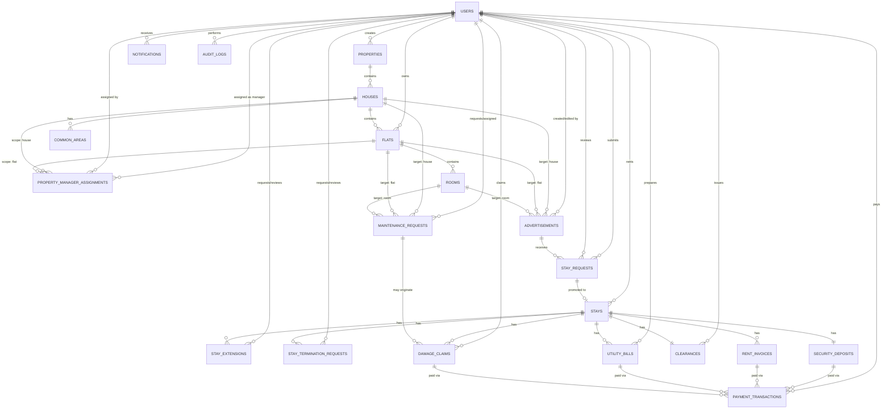

# Housing & Roommate Management Platform — Database Design

## 1. Scope Assumptions

- Hierarchy: `Property → House → Flat → Room`. A "house with one flat" is modeled as a `House` with `house_type = SINGLE_FLAT` and exactly one child `Flat` row (rooms attach to that flat).
- Ownership is tracked at `Flat` level (`flats.owner_id`). A single owner owning every flat in a house effectively owns the whole house — no separate house-level owner column.
- Common areas (stairs, parking, rooftop) belong to a `House` and are implicitly shared by every owner of that house's flats — no separate ownership join table needed.
- A Property Manager can be scoped to a `House` (all its flats/rooms) or to a single `Flat`. Multiple concurrent assignments are allowed.
- Owner and Manager registrations require Admin approval; Tenant registration does not — modeled as fields on `users`, not a separate approval table.
- Advertisement `HOUSE` target is only valid for `house_type = SINGLE_FLAT` houses (enforced at application layer, noted here as a rule).
- Financial documents (`security_deposits`, `rent_invoices`, `utility_bills`, `damage_claims`) are separated by purpose; `payment_transactions` is the single ledger of actual money movement, linked polymorphically to whichever document was paid.
- Tenant self-published ads (mentioned as optional/deferred in requirements) are **excluded**.

---

## 2. ERD (entities & relationships)

---

## 3. Table Details

### 3.1 Identity & Access

**users**
| Column | Type | Constraints |
|---|---|---|
| id | BIGINT | PK |
| name | VARCHAR(150) | NOT NULL |
| email | VARCHAR(255) | UNIQUE, NOT NULL |
| phone | VARCHAR(20) | UNIQUE |
| password_hash | VARCHAR(255) | NOT NULL |
| role | ENUM(OWNER, MANAGER, TENANT, ADMIN) | NOT NULL |
| approval_status | ENUM(NOT_REQUIRED, PENDING, APPROVED, REJECTED) | default NOT_REQUIRED for TENANT/ADMIN |
| approved_by | BIGINT | FK → users.id, nullable |
| approved_at | TIMESTAMP | nullable |
| account_status | ENUM(ACTIVE, SUSPENDED) | default ACTIVE |
| created_at / updated_at | TIMESTAMP | NOT NULL |

### 3.2 Property Hierarchy

**properties**
| Column | Type | Constraints |
|---|---|---|
| id | BIGINT | PK |
| created_by | BIGINT | FK → users.id (OWNER) |
| name | VARCHAR(150) | NOT NULL |
| address_line, city, area | VARCHAR | NOT NULL |
| latitude, longitude | DECIMAL | nullable |
| created_at / updated_at | TIMESTAMP | |

**houses**
| Column | Type | Constraints |
|---|---|---|
| id | BIGINT | PK |
| property_id | BIGINT | FK → properties.id, NOT NULL |
| house_type | ENUM(SINGLE_FLAT, MULTI_FLAT) | NOT NULL |
| name | VARCHAR(150) | |
| created_at / updated_at | TIMESTAMP | |

**flats**
| Column | Type | Constraints |
|---|---|---|
| id | BIGINT | PK |
| house_id | BIGINT | FK → houses.id, NOT NULL |
| owner_id | BIGINT | FK → users.id (OWNER), NOT NULL |
| flat_number | VARCHAR(30) | NOT NULL |
| status | ENUM(ACTIVE, REMOVED) | default ACTIVE |
| created_at / updated_at | TIMESTAMP | |
| Constraint | | For `house_type = SINGLE_FLAT` houses, exactly one active flat row |

**rooms**
| Column | Type | Constraints |
|---|---|---|
| id | BIGINT | PK |
| flat_id | BIGINT | FK → flats.id, NOT NULL |
| room_number | VARCHAR(30) | NOT NULL |
| status | ENUM(ACTIVE, REMOVED) | default ACTIVE |
| created_at / updated_at | TIMESTAMP | |

**common_areas**
| Column | Type | Constraints |
|---|---|---|
| id | BIGINT | PK |
| house_id | BIGINT | FK → houses.id, NOT NULL |
| name | VARCHAR(100) | e.g. Stairs, Parking, Rooftop |
| description | TEXT | nullable |

**property_manager_assignments**
| Column | Type | Constraints |
|---|---|---|
| id | BIGINT | PK |
| manager_id | BIGINT | FK → users.id (MANAGER), NOT NULL |
| house_id | BIGINT | FK → houses.id, nullable |
| flat_id | BIGINT | FK → flats.id, nullable |
| assigned_by | BIGINT | FK → users.id (OWNER or MANAGER) |
| status | ENUM(ACTIVE, REVOKED) | default ACTIVE |
| assigned_at | TIMESTAMP | |
| revoked_at | TIMESTAMP | nullable |
| Constraint | | exactly one of `house_id` / `flat_id` NOT NULL |

### 3.3 Advertisements

**advertisements**
| Column | Type | Constraints |
|---|---|---|
| id | BIGINT | PK |
| target_type | ENUM(HOUSE, FLAT, ROOM) | NOT NULL |
| house_id | BIGINT | FK → houses.id, nullable |
| flat_id | BIGINT | FK → flats.id, nullable |
| room_id | BIGINT | FK → rooms.id, nullable |
| title | VARCHAR(200) | NOT NULL |
| description | TEXT | |
| rent_amount | DECIMAL(12,2) | NOT NULL |
| security_deposit_amount | DECIMAL(12,2) | NOT NULL, default = 1 month rent |
| available_from | DATE | NOT NULL; if target is currently rented, must be after existing stay's end/move-out date |
| status | ENUM(DRAFT, PUBLISHED, UNPUBLISHED, RENTED, ARCHIVED) | default DRAFT |
| created_by | BIGINT | FK → users.id (OWNER or MANAGER) |
| last_modified_by | BIGINT | FK → users.id |
| published_at | TIMESTAMP | nullable |
| created_at / updated_at | TIMESTAMP | |
| Constraint | | exactly one of `house_id`/`flat_id`/`room_id` NOT NULL, matching `target_type`; `HOUSE` target only valid when the house's `house_type = SINGLE_FLAT` |

### 3.4 Stay Lifecycle

**stay_requests**
| Column | Type | Constraints |
|---|---|---|
| id | BIGINT | PK |
| advertisement_id | BIGINT | FK → advertisements.id, NOT NULL |
| tenant_id | BIGINT | FK → users.id (TENANT), NOT NULL |
| requested_start_date | DATE | NOT NULL |
| requested_end_date | DATE | NOT NULL; last day of a month |
| status | ENUM(PENDING, APPROVED, REJECTED, CANCELLED) | default PENDING |
| reviewed_by | BIGINT | FK → users.id, nullable |
| reviewed_at | TIMESTAMP | nullable |
| created_at / updated_at | TIMESTAMP | |
| Rule | | min. stay 1 month; start date mid-month only allowed if start falls within the current (running) month, else must be the 1st; end date always the last day of a month |

**stays**
| Column | Type | Constraints |
|---|---|---|
| id | BIGINT | PK |
| stay_request_id | BIGINT | FK → stay_requests.id, UNIQUE, NOT NULL |
| tenant_id | BIGINT | FK → users.id, NOT NULL |
| advertisement_id | BIGINT | FK → advertisements.id, NOT NULL |
| target_type | ENUM(HOUSE, FLAT, ROOM) | denormalized from advertisement |
| house_id / flat_id / room_id | BIGINT | FK, nullable, matching target_type |
| start_date | DATE | NOT NULL |
| end_date | DATE | NOT NULL |
| monthly_rent | DECIMAL(12,2) | NOT NULL, snapshot at signing |
| approved_by | BIGINT | FK → users.id |
| approved_at | TIMESTAMP | |
| status | ENUM(AWAITING_DEPOSIT, ACTIVE, EXTENDED, TERMINATION_REQUESTED, TERMINATED_EARLY, REVOKED, COMPLETED) | default AWAITING_DEPOSIT |
| revoked_reason | VARCHAR(255) | nullable |
| revoked_at | TIMESTAMP | nullable |
| created_at / updated_at | TIMESTAMP | |

**stay_extensions**
| Column | Type | Constraints |
|---|---|---|
| id | BIGINT | PK |
| stay_id | BIGINT | FK → stays.id, NOT NULL |
| requested_by | BIGINT | FK → users.id (TENANT) |
| new_end_date | DATE | NOT NULL |
| new_monthly_rent | DECIMAL(12,2) | nullable; custom price for extension |
| status | ENUM(PENDING, APPROVED, REJECTED) | default PENDING |
| reviewed_by | BIGINT | FK → users.id, nullable |
| reviewed_at | TIMESTAMP | nullable |
| created_at / updated_at | TIMESTAMP | |

**stay_termination_requests**
| Column | Type | Constraints |
|---|---|---|
| id | BIGINT | PK |
| stay_id | BIGINT | FK → stays.id, NOT NULL |
| requested_by | BIGINT | FK → users.id (TENANT) |
| requested_end_date | DATE | NOT NULL |
| reason | TEXT | nullable |
| status | ENUM(PENDING, APPROVED, REJECTED) | default PENDING |
| reviewed_by | BIGINT | FK → users.id, nullable |
| reviewed_at | TIMESTAMP | nullable |
| refund_security_deposit | BOOLEAN | default FALSE |
| refund_advance_deposit | BOOLEAN | default FALSE |
| created_at / updated_at | TIMESTAMP | |

### 3.5 Financials

**security_deposits**
| Column | Type | Constraints |
|---|---|---|
| id | BIGINT | PK |
| stay_id | BIGINT | FK → stays.id, UNIQUE, NOT NULL |
| amount | DECIMAL(12,2) | NOT NULL |
| due_date | DATE | NOT NULL; = MIN(approval_time + 1 day, stay_start_date) unless overridden by owner/manager |
| status | ENUM(PENDING, PAID, FORFEITED, REFUNDED, PARTIALLY_REFUNDED) | default PENDING |
| paid_at | TIMESTAMP | nullable |
| refunded_amount | DECIMAL(12,2) | nullable |
| refunded_at | TIMESTAMP | nullable |
| created_at / updated_at | TIMESTAMP | |

**rent_invoices**
| Column | Type | Constraints |
|---|---|---|
| id | BIGINT | PK |
| stay_id | BIGINT | FK → stays.id, NOT NULL |
| period_start_date | DATE | NOT NULL |
| period_end_date | DATE | NOT NULL |
| days_count | INT | NOT NULL |
| amount | DECIMAL(12,2) | NOT NULL; full month, or `monthly_rent / 30 × days_count` for partial month |
| due_date | DATE | NOT NULL; payable window opens 15 days prior |
| status | ENUM(PENDING, PAID, OVERDUE, WAIVED) | default PENDING |
| paid_at | TIMESTAMP | nullable |
| created_at / updated_at | TIMESTAMP | |
| Constraint | | UNIQUE(stay_id, period_start_date) |

**utility_bills**
| Column | Type | Constraints |
|---|---|---|
| id | BIGINT | PK |
| stay_id | BIGINT | FK → stays.id, NOT NULL |
| prepared_by | BIGINT | FK → users.id (OWNER/MANAGER) |
| billing_period_start / billing_period_end | DATE | NOT NULL |
| amount | DECIMAL(12,2) | NOT NULL |
| due_date | DATE | NOT NULL; within 7 days of last stay date |
| status | ENUM(PENDING, PAID, OVERDUE, CLAIMED_FROM_DEPOSIT) | default PENDING |
| paid_at | TIMESTAMP | nullable |
| created_at / updated_at | TIMESTAMP | |

**maintenance_requests**
| Column | Type | Constraints |
|---|---|---|
| id | BIGINT | PK |
| target_type | ENUM(HOUSE, FLAT, ROOM) | NOT NULL |
| house_id / flat_id / room_id | BIGINT | FK, nullable, matching target_type |
| requested_by | BIGINT | FK → users.id (OWNER/MANAGER) |
| assigned_to | BIGINT | FK → users.id, nullable |
| description | TEXT | NOT NULL |
| status | ENUM(OPEN, IN_PROGRESS, RESOLVED, CLOSED) | default OPEN |
| created_at / updated_at | TIMESTAMP | |

**damage_claims**
| Column | Type | Constraints |
|---|---|---|
| id | BIGINT | PK |
| stay_id | BIGINT | FK → stays.id, NOT NULL |
| maintenance_request_id | BIGINT | FK → maintenance_requests.id, nullable |
| claimed_by | BIGINT | FK → users.id (OWNER/MANAGER) |
| amount | DECIMAL(12,2) | NOT NULL |
| due_date | DATE | NOT NULL; within 10 days of last stay date |
| status | ENUM(PENDING, PAID, CLAIMED_FROM_DEPOSIT, WAIVED) | default PENDING |
| paid_at | TIMESTAMP | nullable |
| created_at / updated_at | TIMESTAMP | |

**payment_transactions**
| Column | Type | Constraints |
|---|---|---|
| id | BIGINT | PK |
| payer_id | BIGINT | FK → users.id (TENANT) |
| payable_type | ENUM(RENT_INVOICE, SECURITY_DEPOSIT, UTILITY_BILL, DAMAGE_CLAIM) | NOT NULL |
| payable_id | BIGINT | NOT NULL; polymorphic reference, no DB-level FK |
| amount | DECIMAL(12,2) | NOT NULL |
| payment_method | VARCHAR(30) | |
| transaction_reference | VARCHAR(100) | UNIQUE |
| status | ENUM(INITIATED, SUCCESS, FAILED, REFUNDED) | default INITIATED |
| paid_at | TIMESTAMP | nullable |
| created_at | TIMESTAMP | |

**clearances**
| Column | Type | Constraints |
|---|---|---|
| id | BIGINT | PK |
| stay_id | BIGINT | FK → stays.id, UNIQUE, NOT NULL |
| issued_by | BIGINT | FK → users.id (OWNER/MANAGER) |
| security_deposit_amount | DECIMAL(12,2) | snapshot |
| utility_deduction | DECIMAL(12,2) | default 0 |
| damage_deduction | DECIMAL(12,2) | default 0 |
| refunded_amount | DECIMAL(12,2) | NOT NULL |
| status | ENUM(PENDING, ISSUED, COMPLETED) | default PENDING |
| issued_at | TIMESTAMP | nullable |
| created_at / updated_at | TIMESTAMP | |

### 3.6 Support

**notifications**
| Column | Type | Constraints |
|---|---|---|
| id | BIGINT | PK |
| user_id | BIGINT | FK → users.id, NOT NULL |
| type | VARCHAR(50) | NOT NULL |
| title | VARCHAR(150) | |
| message | TEXT | |
| is_read | BOOLEAN | default FALSE |
| created_at | TIMESTAMP | |

**audit_logs**
| Column | Type | Constraints |
|---|---|---|
| id | BIGINT | PK |
| actor_id | BIGINT | FK → users.id, NOT NULL |
| action | VARCHAR(100) | NOT NULL |
| entity_type | VARCHAR(50) | NOT NULL |
| entity_id | BIGINT | NOT NULL |
| metadata | JSON | nullable |
| created_at | TIMESTAMP | |

---

## 4. Indexing Notes

- `flats.owner_id`, `property_manager_assignments.manager_id` — dashboard lookups.
- `advertisements(status, target_type)` and `advertisements.available_from` — search/filter.
- `stays(status, end_date)` — expiry/renewal jobs.
- `rent_invoices(status, due_date)`, `utility_bills(status, due_date)`, `damage_claims(status, due_date)` — overdue-payment jobs.
- `payment_transactions(payable_type, payable_id)` — reconciliation lookups.
